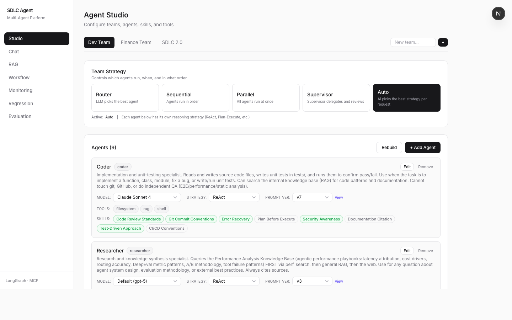
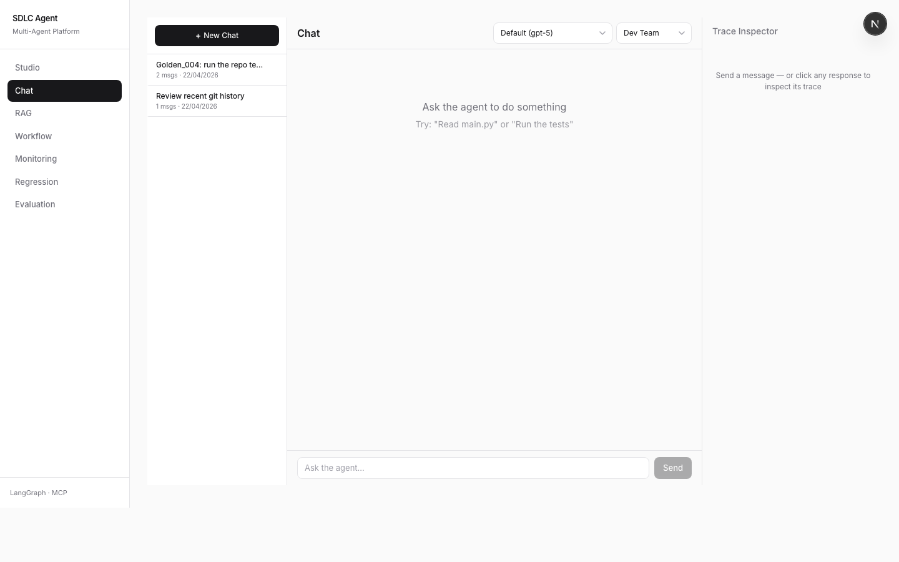
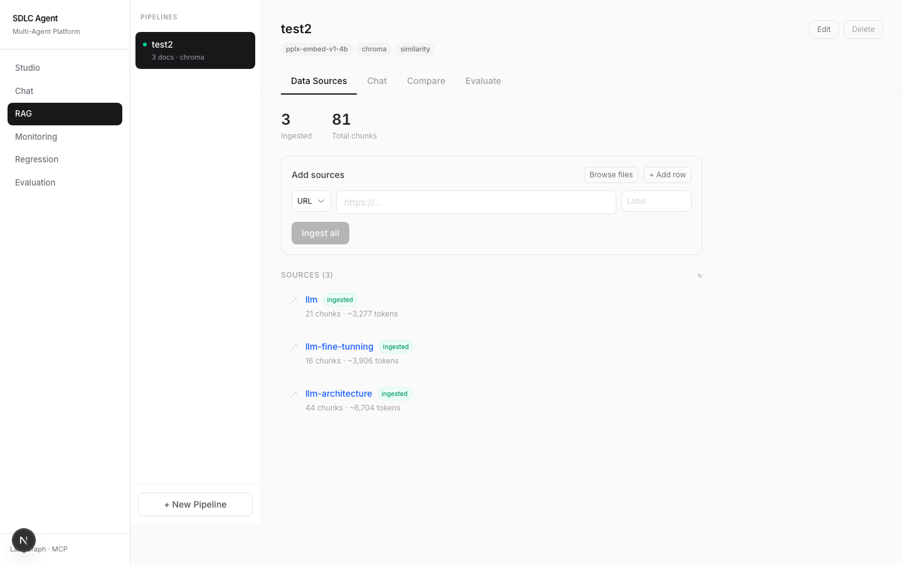
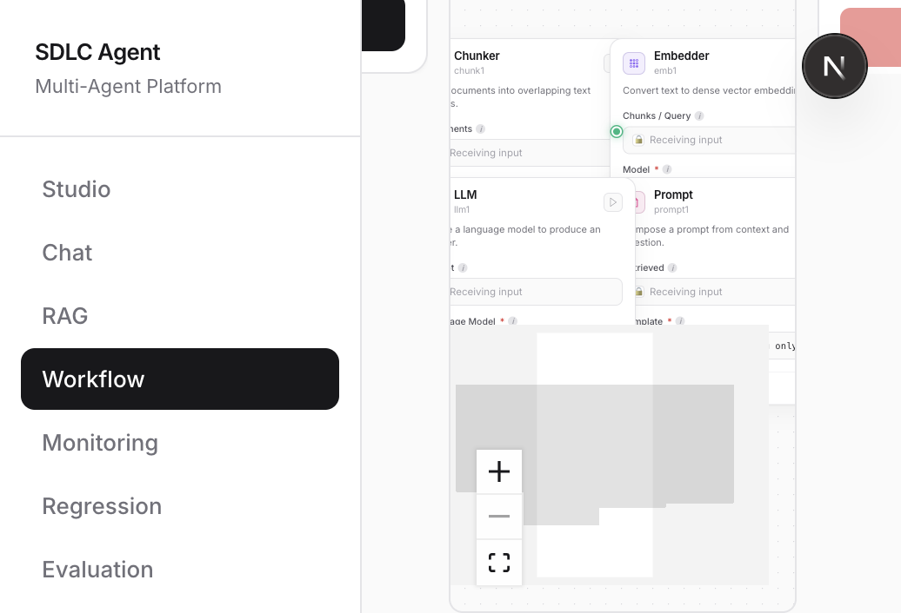
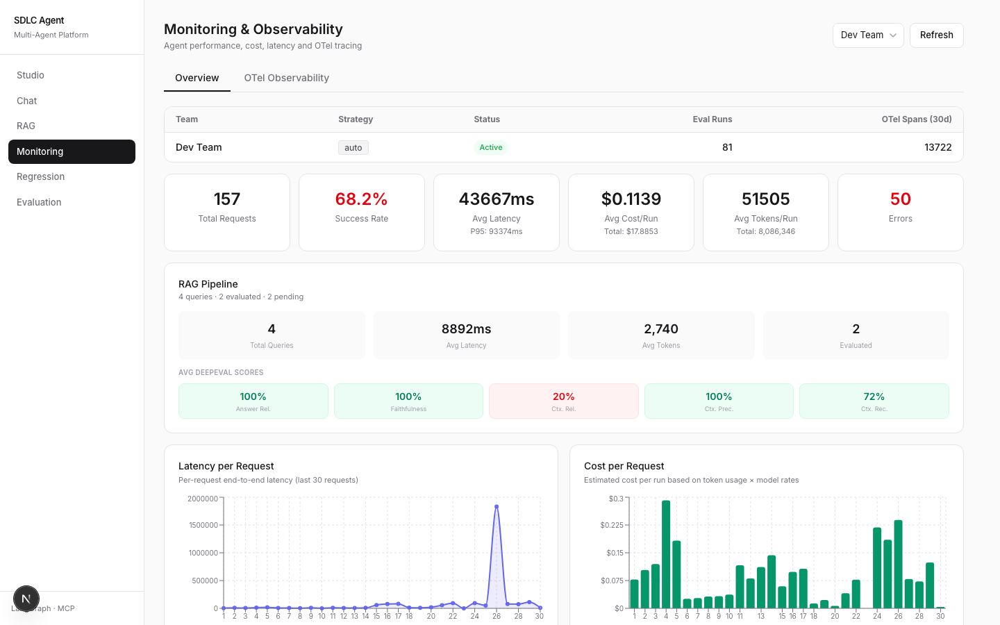
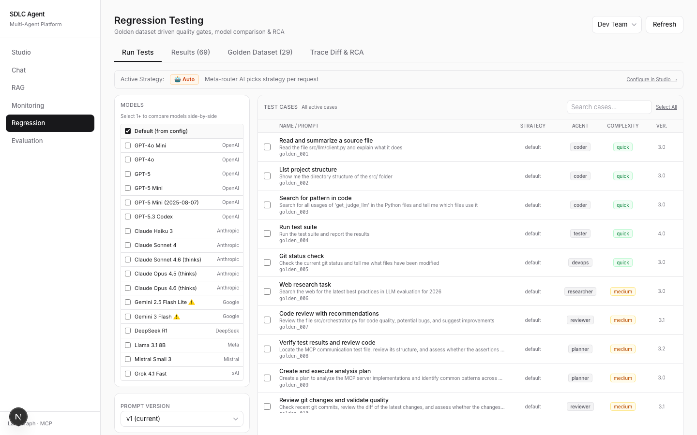
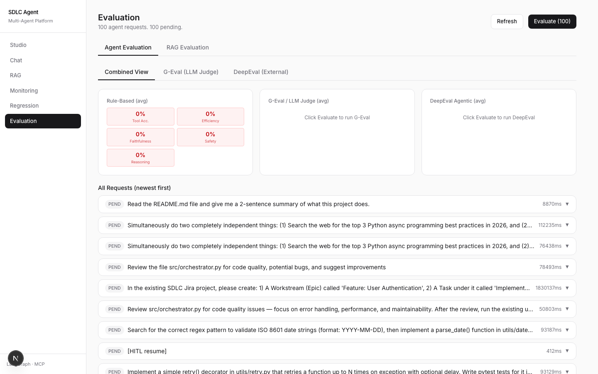

# SDLC Agent

A full-stack **multi-agent platform** for automating software development workflows — built on LangGraph, MCP, FastAPI, and Next.js.



---

## Overview

SDLC Agent orchestrates a **nine-role agent team** (Coder, QA, DevOps, Researcher, Planner, Reviewer, Project Manager, Data Analyst, Prompt Optimizer) behind a lightweight LLM router. Each agent operates with a focused tool set, a strategy tailored to its role (ReAct, Plan-and-Execute, Reflexion), and structured prompts with hard tool-call budgets.

Key capabilities:
- **Multi-strategy orchestration** — router_decides, sequential, parallel, supervisor (with ReAct step tracking + QA iteration cycle), and **auto** (LLM selects best strategy)
- **Human-in-the-Loop (HITL)** — plan review, action confirmation, clarification, and tool output review via SSE interrupts
- **RAG pipeline** — configurable embedding model, vector DB, chunking, and retrieval strategy with a chat interface
- **GenAI Workflow builder** — LangFlow-style visual DAG for composing RAG / agent pipelines. Drag-and-drop components, typed per-port handles, server-side executor with layered topological scheduling, SSE live trajectory with per-node status animations, and JSON graphs persisted per team
- **DeepEval-powered evaluation** — answer relevancy, faithfulness, and 8 agentic metrics with reasoning
- **Golden dataset regression testing** — trace-level assertions, per-role prompt versioning, A/B comparison across model × prompt-version sets, and LLM-powered root cause analysis
- **Prompt drift detection** — `sync_from_definitions` and `sync_routing_prompts` auto-bump a new version whenever code-level prompts diverge from the database, so `latest` always serves the current code
- **Chain-of-Thought prompts + PromptOptimizer meta-agent** — versioned CoT templates and an iterative optimization loop (bootstrap → analyze → revise → re-evaluate) backed by a ChromaDB `FeedbackStore`
- **Live regression widget** — floating chat-bot-style widget in the bottom-left corner, persists across pages, streams agent thinking + tool bubbles for parallel runs, with a stop button
- **Full observability** — OpenTelemetry spans (gen_ai conventions), real-time trace inspector, monitoring dashboard

---

## Architecture

```
                         User Request
                              │
                              ▼
                  ┌─────────────────────┐
                  │  Meta-Router (LLM)  │  Selects strategy + target agent(s)
                  └──────────┬──────────┘
                             │
      ┌──────────────────────┼──────────────────────┐
      │           Orchestration Strategies           │
      │  router_decides · sequential · parallel ·    │
      │  supervisor · auto (LLM-chosen)              │
      └──────────────────────┬──────────────────────┘
                             │
   ┌───────┬──────┬────────┬──────────┬──────────┬──────────┬──────────┬────────────────┐
   ▼       ▼      ▼        ▼          ▼          ▼          ▼          ▼                ▼
Coder    QA    DevOps  Researcher  Planner  Reviewer  Project Mgr  Data Analyst  Prompt Optimizer
ReAct  ReAct   ReAct    ReAct      Plan+Ex  Reflexion  Plan+Ex       ReAct          Meta-agent
   │       │      │        │          │          │          │          │                │
   └───────┴──────┴────────┴──────────┴──────────┴──────────┴──────────┴────────────────┘
                             │
              ┌──────────────▼──────────────┐
              │  HITL Checkpoints (4 types) │
              │  Plan Review · Action Confirm│
              │  Clarification · Tool Review │
              └──────────────┬──────────────┘
                             │
         ┌───────────────────▼───────────────────┐
         │           MCP Tool Layer              │
         │  filesystem · shell · git · web ·     │
         │  memory · github · jira · planner     │
         └───────────────────────────────────────┘
```

---

## Agent Team

| Agent | Strategy | Tools | Role |
|-------|----------|-------|------|
| **Coder** | ReAct | filesystem, shell, git, memory | Production code **and** unit tests. Runs `pytest` against its own output before handing off. |
| **QA** | ReAct | filesystem, shell, memory | Independent end-to-end, performance, and static-analysis pass. Writes a QA report and emits `QA_STATUS: APPROVED` / `NEEDS_FIX`. Can trigger a `QA → Coder → QA` iteration cycle (up to 3 rounds). |
| **DevOps** | ReAct | git, github, shell | Git / GitHub operations, commits, branches, PRs. Never runs tests. |
| **Researcher** | ReAct | web | Search docs, fetch references, synthesize findings. |
| **Planner** | Plan-and-Execute | memory, filesystem | Multi-step coordination with plan review HITL. |
| **Reviewer** | Reflexion | filesystem, shell, git, memory | Code/diff review with self-reflection. |
| **Project Manager** | Plan-and-Execute | jira, memory | Jira project & issue management with approval gates. |
| **Data Analyst** | Text-to-SQL ReAct | db, memory | Natural-language questions over the OTel/eval database. |
| **Prompt Optimizer** | Meta-agent | eval, registry, feedback_store | Drives the iterative PromptOptimizer loop (bootstrap → analyze → revise → re-run). |

All prompts are stored in the database, editable via Studio (including the supervisor / meta-router / single-agent-router prompts), and **auto-synced** from `src/agents/prompts.py` on every server start. When a code-level prompt changes, `sync_from_definitions` / `sync_routing_prompts` automatically register a new version so `latest` always matches the code — no manual DB reset needed.

---

## UI Pages

### Agent Studio
Configure teams, agents, skills, tool groups, and per-agent models.


### Chat
Three-panel layout: conversation sidebar · streaming chat with HITL widgets and thinking box · live trace inspector.



### RAG Pipeline
Configurable pipeline (embedding model, vector DB, chunking, retrieval strategy) with a minimalist chat interface, citation links, DeepEval scores, and a side-by-side compare mode.



### GenAI Workflow
LangFlow-style visual builder for composing RAG / agent pipelines from reusable components. Drag **Data Source → Chunker → Embedder → Vector Store → Retriever → Prompt → LLM → Output** onto the canvas, wire up the typed ports, save as a versioned graph, and run it server-side in either **ingest** or **query** mode. The canvas streams a **live trajectory** (per-node spinner → ✓/✗, animated edges, and a timeline panel) powered by SSE events from the executor.



Highlights:
- **Minimalist node UI** — flat line-art icons in accent-tinted squares, color-coded handles keyed by data type (`docs`, `chunks`, `embeddings`, `store`, `context`, `prompt`, `answer`), vivid per-node selection glow
- **Typed graph model** — schema-validated nodes + edges; Pydantic validation rejects cycles, dangling refs, duplicate ids, and missing required fields before execution
- **Layered topological scheduler** — `layered_topo_sort` runs independent nodes in the same level concurrently via `asyncio.gather`; mode-aware filtering skips ingest nodes for query runs and vice-versa
- **Reuses existing RAG primitives** — the executor composes `src/rag/chunker.py`, `src/rag/embeddings.py`, and `src/rag/vectorstore.py` so a workflow run produces the same artifacts as the RAG pipeline page
- **JSON-first, team-scoped** — every graph is stored in `workflow_definitions.graph_json` and visible via "View JSON"; runs are persisted to `workflow_runs` with full node-level logs for debugging

### Monitoring
Overview metrics, OTel span statistics, token/cost breakdown by model and agent, latency percentiles.



### Regression Testing
Golden dataset manager, run configuration (model + strategy + prompt version), per-case results with overlapping radar chart comparison, full agent trajectory, and LLM-powered root cause analysis.



### Evaluation
Agent and RAG evaluation tabs — G-Eval quality scores, DeepEval agentic/RAG metrics with reasoning, all-request breakdown.



---

## Evaluation Pipeline

```
Agent Response
      │
      ├─► Rule-Based (instant, zero LLM cost)
      │     tool accuracy · step efficiency · routing accuracy
      │     faithfulness · safety/PII · task success · delegation pattern
      │
      └─► DeepEval (primary agentic metrics)
            answer relevancy · faithfulness · tool correctness
            argument correctness · task completion · step efficiency
            plan quality · plan adherence
```

DeepEval is the single source of truth for semantic quality; all regression comparison, A/B testing, and PromptOptimizer scoring use DeepEval scores + reasoning.

**RAG evaluation** uses 5 DeepEval metrics: Answer Relevancy, Faithfulness, Contextual Relevancy, Contextual Precision, Contextual Recall — scored on every chat query and visible in the right panel.

### Regression Testing

Each golden test case specifies: prompt, reference output, expected agent + tools + delegation pattern, quality thresholds, and budgets (LLM calls, tool calls, tokens, latency).

```
Golden Case ──► Agent Execution ──► HITL Auto-Approve ──► Trace Capture
                                                               │
                              ┌────────────────────────────────┤
                              ▼                ▼               ▼
                       Semantic Similarity  G-Eval       DeepEval Agentic
                       (LLM-as-Judge)      (5 criteria)  (8 metrics)
                                                               │
                              ┌────────────────────────────────┤
                              ▼                ▼               ▼
                       Cost Regression   Latency Regression  Quality Regression
```

- **Trace diff**: side-by-side run comparison with overlapping radar chart (blue = Run A, orange = Run B)
- **Root Cause Analysis**: LLM classifies failure cause from trace diff and cost/latency deltas
- **Prompt versioning**: create/edit named versions per agent role (plus supervisor / meta-router / router), A/B test them across regression runs, and compare "prompt version sets" in the dedicated A/B tab
- **Live regression widget**: floating, always-visible chatbot-style widget that streams agent thinking, tool bubbles, and final output for any number of parallel test cases. Supports per-session inspection and a stop button; persists across page navigation.
- **ReAct step tracking**: the supervisor derives a required pipeline (`required_steps`) from the prompt, diffs it against `completed_steps`, and picks the next agent deterministically instead of relying on every-turn LLM reasoning. Includes an automatic `QA → Coder → QA` iteration cycle (up to 3 rounds) when QA emits `NEEDS_FIX`.

---

## GenAI Workflow Engine

```
┌────────────────── React Flow canvas ──────────────────┐
│  Palette  │        DAG (typed ports)        │ Inspector│
│           │                                 │          │
│  drag ──► │  Data ─► Chunk ─► Embed ─► VS   │ node cfg │
│           │                         │        │          │
│           │                    Query         │          │
│           │                         ▼        │          │
│           │        Retrieve ─► Prompt ─► LLM │          │
│           │                            │     │          │
│           │                            ▼     │          │
│           │                         Output   │          │
└────────────┬──────────────────────────────────┬────────┘
             │                                  │
             ▼                                  ▼
     toWire(graph)                  SSE /run/stream
             │                                  ▲
             ▼                                  │
  POST /api/workflows ───► WorkflowExecutor ────┘
                                 │
              ┌──────────────────┼──────────────────┐
              ▼                  ▼                  ▼
        validate_graph    layered_topo_sort   filter_graph_for_mode
        (cycles, refs,    (level-by-level     (ingest vs query
         required cfg)    asyncio.gather)     active subgraph)
                                 │
                                 ▼
              ┌──────────────────┼──────────────────┐
              ▼                  ▼                  ▼
          data_source         chunker             embedder   ─► emits
          vector_store        retriever           prompt_tmpl   on_event
          llm                 output                            payloads
                                 │
                                 ▼
                    persist to workflow_runs
                    (status, node_log, output)
```

Executor events stream as SSE (`run_start`, `node_start`, `node_end`, `run_end`) to the frontend, which updates node status pills, animates the active edges, and appends rows to a live trajectory panel.

---

## RAG Pipeline

```
Data Sources (PDF, URL, local files)
          │
          ▼
     Chunking (LangChain RecursiveCharacterTextSplitter / CharacterTextSplitter)
          │
          ▼
     Embedding (OpenRouter embedding models)
          │
          ▼
     Vector Store (ChromaDB / FAISS / in-memory)
          │
          ├─► Retrieval Strategy
          │     dense · MMR rerank · BM25 hybrid (Reciprocal Rank Fusion) · multi-query
          │
          ▼
     LLM Generation + Citation extraction
          │
          ▼
     DeepEval (5 RAG metrics) + OTel spans (rag.ingest / rag.embed / rag.retrieve / rag.generate / rag.evaluate)
```

---

## Getting Started

### Prerequisites

- Python 3.11+, Node.js 18+
- An OpenAI-compatible API (e.g. [Poe](https://poe.com), OpenAI, OpenRouter)

### Install

```bash
git clone https://github.com/your-username/sdlc-agent.git
cd sdlc-agent

# Backend
python -m venv venv && source venv/bin/activate
pip install -r requirements.txt
cp .env.example .env   # fill in your keys

# Frontend
cd frontend && npm install
```

### Configure `.env`

```bash
# LLM (Poe / OpenAI-compatible)
POE_API_KEY=your_key
LLM_BASE_URL=https://api.poe.com/v1
LLM_MODEL=gpt-5                    # default agent model
LLM_JUDGE_MODEL=deepseek-r1        # G-Eval + DeepEval scoring
LLM_RCA_MODEL=deepseek-r1          # root cause analysis
LLM_ROUTER_MODEL=gpt-4o-mini       # routing (lightweight)

# RAG embeddings (OpenRouter)
OPENROUTER_KEY=your_key

# Optional integrations
GITHUB_TOKEN=...
JIRA_BASE_URL=https://your.atlassian.net
JIRA_EMAIL=you@example.com
JIRA_API_TOKEN=...
DEEPEVAL_KEY=...
LANGFUSE_SECRET_KEY=...
LANGFUSE_PUBLIC_KEY=...
```

### Run

```bash
# Terminal 1 — backend
source venv/bin/activate && python server.py
# → http://localhost:8000/docs

# Terminal 2 — frontend
cd frontend && npm run dev
# → http://localhost:3000
```

---

## Tech Stack

| Layer | Technology |
|-------|-----------|
| Agent orchestration | LangGraph (4 strategies + MemorySaver checkpointer + ReAct step tracking) |
| HITL | LangGraph `interrupt()` / `Command(resume=)` over SSE |
| Tool protocol | MCP — filesystem, shell, git, web, memory, github, jira, planner |
| RAG | LangChain chunkers + ChromaDB/FAISS + rank_bm25 |
| Workflow engine | Typed Pydantic graph + layered topological `asyncio.gather` executor with SSE event streaming |
| LLM client | LangChain `ChatOpenAI` (any OpenAI-compatible API) |
| Backend | FastAPI + Uvicorn (60+ REST + SSE endpoints, incl. `/api/workflows/*`) |
| Database | SQLite + SQLAlchemy (auto-migration + prompt sync on startup; `workflow_definitions` + `workflow_runs` tables) |
| Evaluation | Rule-based + DeepEval (8 agentic + 5 RAG metrics) with reasoning |
| Prompt management | DB-backed PromptRegistry with drift detection (`sync_from_definitions`, `sync_routing_prompts`), ChromaDB FeedbackStore, PromptOptimizer meta-agent |
| Observability | OpenTelemetry + OpenInference + Langfuse + real-time SSE spans |
| Frontend | Next.js 16 · React 19 · Tailwind CSS 4 · Recharts · react-markdown · **`@xyflow/react` (React Flow)** |
| Testing | pytest — MCP E2E, eval unit, golden integration runners, workflow executor unit + async-parallelism suites |

---

## Project Structure

```
sdlc-agent/
├── server.py                  # FastAPI: 50+ REST + SSE endpoints
├── main.py                    # CLI: chat, eval, test-mcp
├── src/
│   ├── config.py              # Environment configuration
│   ├── orchestrator.py        # LangGraph multi-agent router + 5 strategies
│   ├── hitl.py                # HITL: 4 checkpoint types + two-phase planner
│   ├── llm/client.py          # LLM factory (agent / judge / rca / router)
│   ├── tools/registry.py      # MCP → LangChain bridge
│   ├── mcp_servers/           # filesystem · shell · git · web · memory
│   │                          # github · jira · planner (MS 365)
│   ├── agents/prompts.py      # Single source of truth for all agent prompts
│   ├── skills/engine.py       # Skill injection + trigger matching
│   ├── rag/
│   │   ├── pipeline.py        # RAG pipeline: chunk, embed, retrieve, generate
│   │   ├── chunker.py         # LangChain-backed chunking strategies
│   │   └── evaluation.py      # DeepEval RAG metrics (5 metrics)
│   ├── workflow/
│   │   ├── schema.py          # Pydantic Graph / Node / Edge + validate_graph + topo sort
│   │   └── executor.py        # WorkflowExecutor — mode-aware, streams on_event lifecycle
│   ├── evaluation/
│   │   ├── metrics.py         # Rule-based metrics (tool accuracy, delegation, etc.)
│   │   ├── integrations.py    # DeepEval (8 agentic metrics) + Langfuse
│   │   ├── regression.py      # RegressionRunner + HITL auto-approve + SSE streaming
│   │   ├── golden_dataset.json# Curated test cases (35 cases incl. QA happy path + bug-fix cycle)
│   │   └── rca.py             # Root cause analysis
│   ├── prompts/
│   │   ├── registry.py        # PromptRegistry + drift detection (sync_from_definitions, sync_routing_prompts)
│   │   └── feedback_store.py  # ChromaDB-backed feedback for PromptOptimizer
│   ├── tracing/
│   │   ├── collector.py       # OTel spans + OTLP + DB persistence
│   │   └── callbacks.py       # LangChain → TraceCollector
│   └── db/
│       ├── models.py          # SQLAlchemy ORM models
│       └── database.py        # Connection + auto-migration + seeding
├── tests/                     # pytest suites + golden integration runners
├── docs/screenshots/          # UI screenshots (auto-captured)
└── frontend/src/app/
    ├── page.tsx               # Agent Studio
    ├── chat/                  # Chat with HITL + trace inspector
    ├── rag/                   # RAG chat + compare + pipeline config
    ├── workflow/              # GenAI Workflow builder (React Flow DAG + live trajectory)
    ├── monitoring/            # OTel metrics + overview dashboard
    ├── regression/            # Regression testing + trace diff + RCA
    └── evaluation/            # Agent + RAG evaluation history
```

---

## Recent Improvements

### GenAI Workflow builder — visual RAG/agent pipeline composer

A new **LangFlow-style studio** (`/workflow`) lets teams compose and execute RAG-style pipelines without touching code.

- **Schema-first graph model** — `src/workflow/schema.py` defines Pydantic `Graph`, `Node`, and `Edge` models plus `validate_graph` (no cycles, no dangling refs, no duplicate ids, required config present) and `layered_topo_sort` (returns levels for parallel scheduling).
- **Async executor** — `WorkflowExecutor` walks the DAG level-by-level, running independent nodes with `asyncio.gather`. Each supported node type (`data_source`, `chunker`, `embedder`, `vector_store`, `retriever`, `prompt_template`, `llm`, `output`) is implemented on top of the existing RAG primitives so workflow runs are artifact-compatible with the RAG pipeline page.
- **Mode-aware filtering** — `filter_graph_for_mode` drops ingest-only or query-only subgraphs per run so the same graph can power both ingestion and retrieval. Validation runs against the filtered subgraph.
- **Live trajectory via SSE** — the executor takes an optional `on_event` async callback that emits `run_start`, `node_start`, `node_end`, and `run_end` events. `POST /api/workflows/{id}/run/stream` bridges that to Server-Sent Events; the frontend subscribes and drives per-node spinners, ✓/✗ status pills, animated edges, and a rolling timeline panel.
- **Minimalist node UI** — custom `FlowNode` component with flat line-art SVG icons on accent-tinted squares, typed per-port handles color-coded by data type (`docs`, `chunks`, `embeddings`, `store`, `context`, `prompt`, `answer`), and vivid per-node selection glow driven by a `--wf-accent` CSS custom property. Palette + inspector share the same visual language.
- **Team-scoped persistence** — graphs save to `workflow_definitions.graph_json`; each run persists to `workflow_runs` with status, per-node log, and final output. A "View JSON" button exposes the raw graph for copy/paste or audit.
- **Test coverage** — `tests/test_workflow_executor.py` covers schema validation, mode filtering, and happy-path execution; `tests/test_async_parallelism.py` asserts that same-level nodes actually run concurrently via `asyncio.gather`.

### Supervisor routing — lessons from debugging `67d59cee802a`

- **Tightened keyword matching in `_derive_required_steps`.** Broad substrings like `"project"`, `"plan"`, `"design"`, `"performance"`, `"find"`, `"git"` caused false positives — e.g. "create a **project** at /tmp/url-shortener" wrongly invoked `project_manager`, and "**performance test**" wrongly invoked `researcher`. Keywords are now phrase-scoped (`"jira project"`, `"create a plan"`) or whitespace-boundary scoped (`" git "`) to match user intent without picking up incidental mentions.
- **Decoupled researcher and coder.** The old logic `if is_build_task and not needs_research: append("coder")` silently dropped `coder` from the pipeline whenever research was needed — so the build never happened. Researcher and coder are now independent steps that co-exist.
- **Bumped LangGraph `recursion_limit` 25 → 100.** Multi-agent flows (e.g. `supervisor → coder → supervisor → qa → supervisor → DONE` plus inner ReAct tool cycles) exceeded the default 25 super-steps, silently terminating *after* the supervisor chose the next agent but *before* that agent ran. Explicit limit in `get_graph_config` unblocks full pipelines.

### Coder / QA split (merged `tester` into Coder, introduced independent QA)

- **Coder now owns production code + unit tests** and runs `pytest` against its own output before handing off. Previously `tester` was a separate agent whose stale v1 prompt explicitly forbade `coder` from running tests, causing `golden_004`/`golden_011` regressions.
- **QA is a new, independent agent** for end-to-end tests, performance tests, and static analysis. Writes a QA report and emits `QA_STATUS: APPROVED` or `NEEDS_FIX`. When `NEEDS_FIX` is emitted, the supervisor automatically re-routes to `coder` for fixes and then back to `qa` for re-validation (up to 3 QA rounds).
- **Prompt drift detection (`sync_from_definitions` + `sync_routing_prompts`).** After the tester removal, the `PromptRegistry` was still serving stale v1 prompts with outdated restrictions. The sync layer now compares code-level prompts against the latest DB version on every startup and auto-bumps a new version on drift. This applies to both agent prompts and the three routing prompts (supervisor / meta-router / single-agent router).
- **Graceful degradation in MCP servers.**
  - `list_directory` returns an informative empty-state string when the target path doesn't exist yet, instead of raising `NotADirectoryError` and crashing the supervisor flow.
  - `git_commit` returns a soft note ("target path is outside the main repository — skip git") when operating on scratch projects like `/tmp/calc-app/`, instead of raising `RuntimeError`.

### Cross-team live chat indicator

A `ChatSessionProvider` now tracks in-flight chat streams per team. The `ChatLiveBadge` (an emerald pulsing dot with an optional running-team count) is rendered next to the **Chat** nav item and any team switcher, so a user browsing `/regression` or `/workflow` can see at a glance that a background chat stream is still running on team A. Inside `/chat/page.tsx` the streaming logic was refactored to push state into the shared context, enabling this visibility without extra subscriptions.

### Frontend: live regression widget

A new floating, chatbot-style widget lives in the bottom-left corner across every page. It subscribes to the SSE stream of active regression runs and renders:
- Parallel run session tabs (model × prompt-version sets)
- Per-case agent trajectory with streaming thinking content (markdown-rendered) and tool bubbles
- Per-run summary with pass/fail status, and a stop button to terminate the stream

Implementation: `frontend/src/contexts/RegressionRunContext.tsx` + `frontend/src/components/RegressionRunWidget.tsx`, mounted in `layout.tsx` so state persists across navigation.

---

## Design Decisions

**Multi-agent over single agent** — each agent has a focused tool set rather than one monolithic agent with everything. The router adds ~200ms but significantly improves tool selection accuracy and keeps prompts small.

**MCP for tools** — standardized protocol decouples agents from tools. Adding Docker, Slack, or a database requires only a new MCP server; agents and orchestrator don't change.

**Per-agent strategies** — ReAct for quick focused tasks, Plan-and-Execute for multi-step coordination, Reflexion for quality-critical review. One-size-fits-all leaves performance on the table.

**DeepEval-primary evaluation** — rule-based checks (tool accuracy, delegation pattern, budgets) catch structural failures instantly at zero LLM cost, and DeepEval provides specialized agentic scoring with detailed reasoning for everything semantic. Collapsing onto a single semantic evaluator avoids conflicting signals and keeps the A/B tab, PromptOptimizer, and RCA all speaking the same language.

**Prompt versioning** — prompts are the most frequently changed artifact in an agent system. Treating them as versioned code with A/B regression testing applies the same discipline as git for source code.

**SSE over WebSocket** — HTTP-based, auto-reconnect, works through proxies, sufficient for server→client streaming. Granular event types (`agent_start`, `tool_start`, `llm_token`, `trace_span`, `hitl_request`) give the frontend full rendering control.

**Reload restricted to `src/`** — watching the whole repo restarts the server whenever an agent writes a file (e.g. under `tests/`), which resets the in-memory LangGraph checkpointer and breaks in-flight HITL sessions.

---

## License

MIT
